### HashMap

### HashMap源码

### HashMap 经典问题

#### 1. 介绍下hashmap底层数据结构

我们现在用的都是 JDK 1.8，底层是由“数组+链表+红黑树”组成，如下图，而在 JDK 1.8 之前是由“数组+链表”组成，

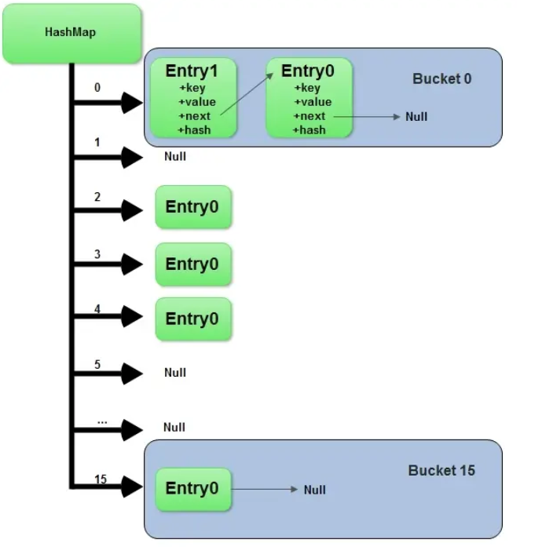 

#### 2. 为什么要改成"数组+链表+红黑树"？

主要是为了提升在 hash 冲突严重时（链表过长）的查找性能，使用链表的查找性能是 O(n)，而使用红黑树是 O(logn) 【二分法】。

#### 3. 那在什么时候用链表？什么时候用红黑树？

- **对于插入**，默认情况下是使用链表节点。当同一个索引位置的节点在新增后达到9个（阈值8）：如果此时数组长度大于等于 64，则会触发链表节点转红黑树节点（treeifyBin）；而如果数组长度小于64，则不会触发链表转红黑树，而是会进行扩容，因为此时的数据量还比较小。
- **对于移除**，当同一个索引位置的节点在移除后达到 6 个，并且该索引位置的节点为红黑树节点，会触发红黑树节点转链表节点（untreeify）。

#### 4. 为什么链表转红黑树的阈值是8？

我们平时在进行方案设计时，必须考虑的两个很重要的因素是：时间和空间。

对于 HashMap 也是同样的道理，简单来说，阈值为8是在时间和空间上权衡的结果。红黑树节点大小约为链表节点的2倍，在节点太少时，红黑树的查找性能优势并不明显，付出2倍空间的代价作者觉得不值得。

理想情况下，使用随机的哈希码，节点分布在 hash 桶中的频率遵循泊松分布，按照泊松分布的公式计算，链表中节点个数为8时的概率为 0.00000006这个概率足够低了，并且到8个节点时，红黑树的性能优势也会开始展现出来，因此8是一个较合理的数字。

#### 5. 那为什么转回链表节点是用的6而不是复用8？

如果我们设置节点多于8个转红黑树，少于8个就马上转链表，当节点个数在8徘徊时，就会频繁进行红黑树和链表的转换，造成性能的损耗。

因此，中间用7间隔起到缓冲的作用，避免频繁 转换

#### 6. 那 HashMap 有哪些重要属性？分别用于做什么的？

除了用来存储我们的节点 table 数组外，HashMap 还有以下几个重要属性

1. size：HashMap 已经存储的节点个数
2. threshold：扩容阈值，当 HashMap 的个数达到该值，触发扩容
3. loadFactor：负载因子，扩容阈值（12） = 容量 （16）* 负载因子（0.75）

#### 7. threshold 除了用于存放扩容阈值还有其他作用吗？

在我们新建 HashMap 对象时， threshold 还会被用来存初始化时的容量。HashMap 直到我们第一次插入节点时，才会对 table 进行初始化，避免不必要的空间浪费。

#### 8. HashMap 的容量有什么限制吗？

默认初始容量是16。HashMap 的容量必须是2的N次方，HashMap 会根据我们传入的容量计算一个大于等于该容量的最小的2的N次方，

> 例如传 9，容量为16。

#### 9. HashMap 如何将容量自动转换为2的N次方的？

```java
static final int tableSizeFor(int cap) {
    int n = cap - 1;
    n |= n >>> 1;
    n |= n >>> 2;
    n |= n >>> 4;
    n |= n >>> 8;
    n |= n >>> 16;
    return (n < 0) ? 1 : (n >= MAXIMUM_CAPACITY) ? MAXIMUM_CAPACITY : n + 1;
}
```

代码解析：

我们先不看第一行“int n = cap - 1”，先看下面的5行计算。

- |=（或等于）：这个符号比较少见，但是“+=”应该都见过，看到这你应该明白了。例如：a |= b ，可以转成：a = a | b。

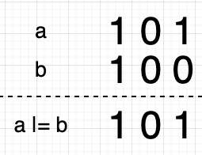 

- ` >>>`（无符号右移）：例如 a >>> b 指的是将 a 向右移动 b 指定的位数，右移后左边空出的位用零来填充，移出右边的位被丢弃。

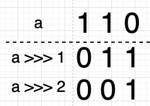 

假设 n 的值为 33 = 0010 0001，则该计算如下图： 

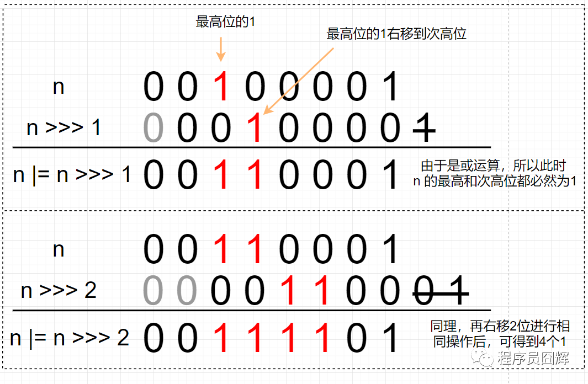 

相信你应该看出来，这5个公式会通过最高位的1，拿到2个1、4个1、8个1、16个1、32个1。当然，有多少个1，取决于我们的入参有多大，但我们肯定的是经过这5个计算，得到的值是一个低位全是1的值，最后返回的时候 +1，则会得到1个比n 大的 2 的N次方。

这时再看开头的 cap - 1 就很简单了，这是为了处理 cap 本身就是 2 的N次方的情况。

计算机底层是二进制的，移位和或运算是非常快的，所以这个方法的效率很高。

> 这是 HashMap 中我个人最喜欢的设计，非常巧妙

#### 10. 为什么 HashMap 的容量必须是 2 的 N 次方?

计算索引位置的公式为：(n - 1) & hash

- 当 n 为 2 的 N 次方时，n - 1 为低位全是 1 的值，此时任何值跟 n - 1 进行 & 运算的结果为该值的低 N 位，达到了和取模同样的效果，实现了均匀分布。实际上，这个设计就是基于公式：x mod 2^n = x & (2^n - 1)，因为 & 运算比 mod 具有更高的效率。

如下图，当 n 不为 2 的 N 次方时，hash 冲突的概率明显增大。

- 0101 = 5    0111 = 7

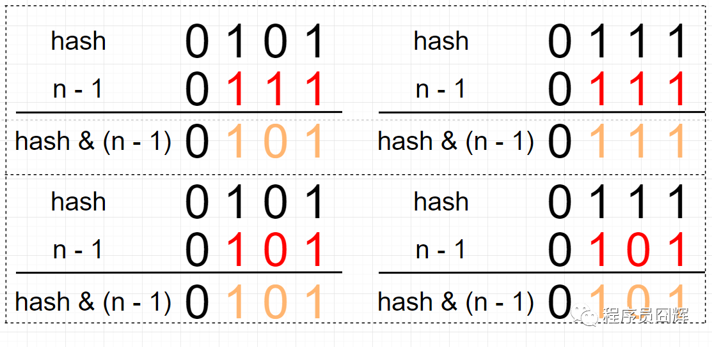

####  11. 为什么HashMap的初始容量是16，而不是其它的？

我认为是16的原因主要是：16是2的N次方，并且是一个较合理的大小。如果用8或32，我觉得也是OK的。实际上，我们在新建 HashMap 时，最好是根据自己使用情况设置初始容量，这才是最合理的方案。

#### 12. 负载因子为什么是 0.75 而不是其它的？

这个也是在时间和空间上权衡的结果。

- 如果值较高，例如1，此时会减少空间开销，但是 hash 冲突的概率会增大，增加查找成本；
- 如果值较低，例如 0.5 ，此时 hash 冲突会降低，但是有一半的空间会被浪费，所以折衷考虑 0.75 似乎是一个合理的值。

#### 13. HashMap 的插入流程是怎么样的？

 

#### 14. HashMap 计算 key 的 hash 值是怎么设计的？

- 拿到 key 的 hashCode，并将 hashCode 的高16位和 hashCode 进行异或（XOR）运算，得到最终的 hash 值。 

```java
static final int hash(Object key) {
    int h;
    return (key == null) ? 0 : (h = key.hashCode()) ^ (h >>> 16);
}
```

#### 15. 为什么要将 hashCode 的高16位参与运算？

主要是为了在 table 的长度较小的时候，让高位也参与运算，并且不会有太大的开销。

例如下图，如果不加入高位运算，由于 n - 1 是 0000 0111，所以结果只取决于 hash 值的低3位，无论高位怎么变化，结果都是一样的。

 

如果我们将高位参与运算，则索引计算结果就不会仅取决于低位。

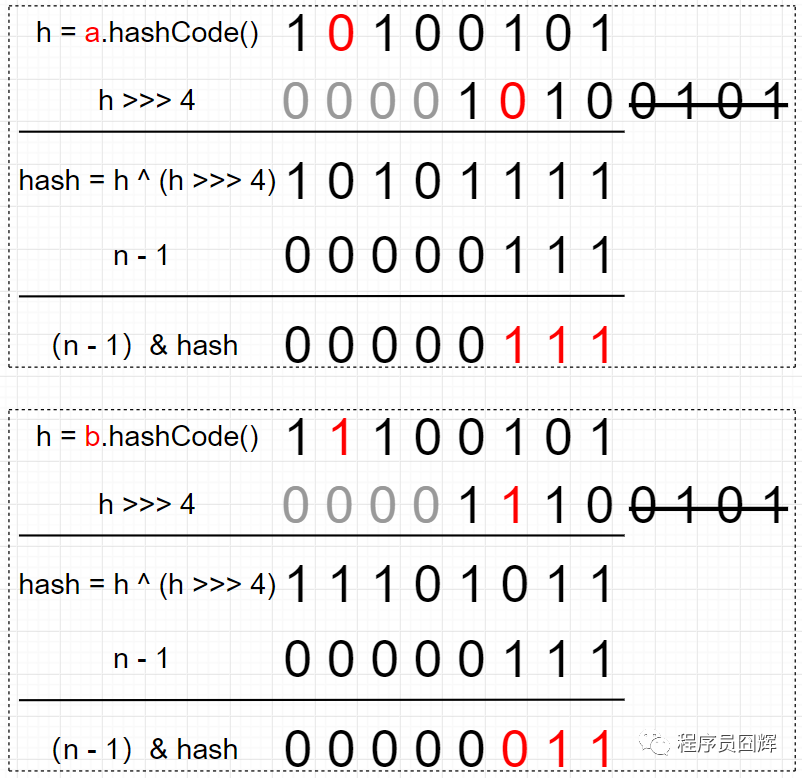 

#### 16. 扩容流程是怎么样的？

 

#### 17. 为什么红黑树和链表都是通过 e.hash & oldCap == 0 来定位在新表的索引位置

- 扩容前 table 的容量为16，a 节点和 b 节点在扩容前处于同一索引位置。

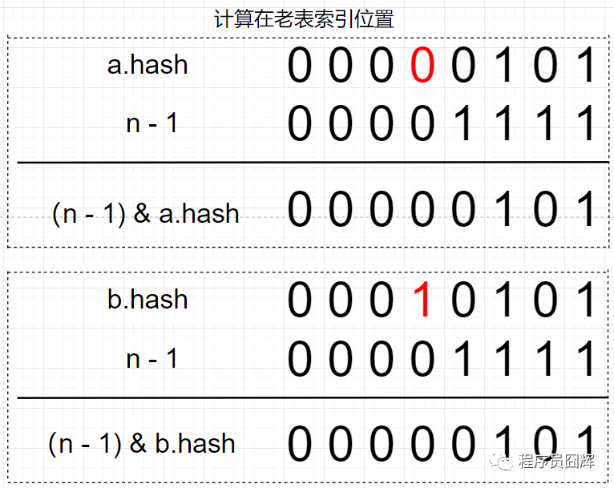 

- 扩容后，table 长度为32，新表的 n - 1 只比老表的 n - 1 在高位多了一个1（图中标红）。

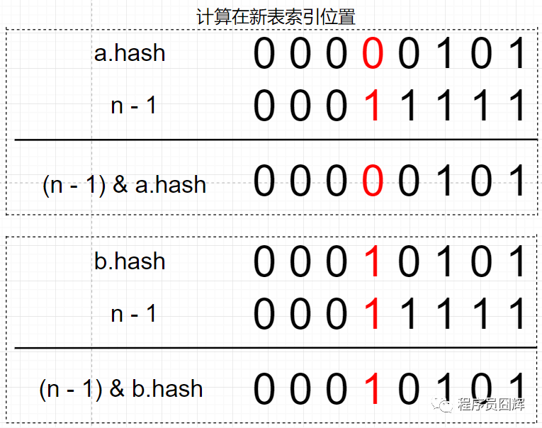 

因为 2 个节点在老表是同一个索引位置，因此计算新表的索引位置时，只取决于新表在高位多出来的这一位（图中标红），而这一位的值刚好等于 oldCap

因为只取决于这一位，所以只会存在两种情况：

1.  (e.hash & oldCap) == 0 ，则新表索引位置为“原索引位置” ；
2. (e.hash & oldCap) != 0，则新表索引位置为“原索引 + oldCap 位置”。

#### 18. HashMap 是线程安全的吗？

不是。HashMap 在并发下存在数据覆盖、遍历的同时进行修改会抛出 ConcurrentModificationException 异常等问题

- JDK 1.8 之前还存在死循环问题(jdk7 头插法导致的)。

#### 19. 介绍一下死循环问题？

导致死循环的根本原因是 JDK 1.7 扩容采用的是“头插法”，会导致同一索引位置的节点在扩容后顺序反掉。

而 JDK 1.8 之后采用的是“尾插法”，扩容后节点顺序不会反掉，不存在死循环问题。

- JDK 1.7.0 的扩容代码如下，用例子来看会好理解点。

```java
void transfer(Entry[] newTable) {
    Entry[] src = table;
    int newCapacity = newTable.length;
    for (int j = 0; j < src.length; j++) {
        Entry<K,V> e = src[j];
        if (e != null) {
            src[j] = null;
            do {
                Entry<K,V> next = e.next;
                int i = indexFor(e.hash, newCapacity);
                e.next = newTable[i];
                newTable[i] = e;
                e = next;
            } while (e != null);
        }
    }
}
```

这个流程较难理解，建议对着代码自己模拟走一遍。

> 案例分析

我们有1个容量为2的 HashMap，loadFactor=0.75，此时线程1和线程2 同时往该 HashMap 插入一个数据，都触发了扩容流程，接着有以下流程。

1. 在2个线程都插入节点，触发扩容流程之前，此时的结构如下图。

    

2. 线程1进行扩容，执行到代码：Entry<K,V> next = e.next 后被调度挂起，此时的结构如下图

   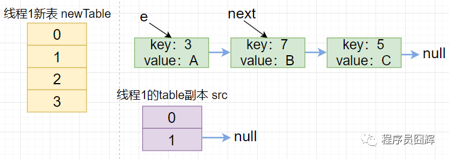 

3. 线程1被挂起后，线程2进入扩容流程，并走完整个扩容流程，此时的结构如下图

   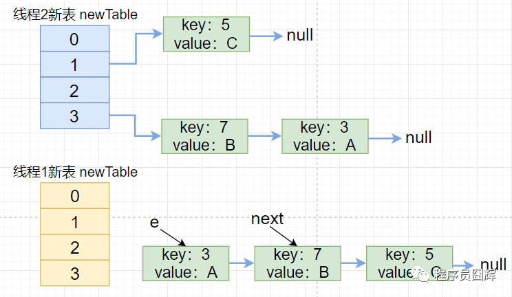 

   由于两个线程操作的是同一个 table，所以该图又可以画成如下图。

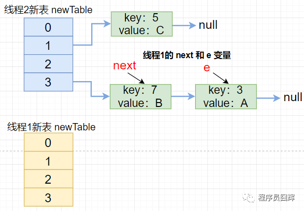 

线程1恢复后，继续走完第一次的循环流程，此时的结构如下图。

 

线程1继续走完第二次循环，此时的结构如下图。

 

线程1继续执行第三次循环，执行到 e.next = newTable[i] 时形成环，执行完第三次循环的结构如下图

 

如果此时线程1调用 map.get(11) ，悲剧就出现了——Infinite Loop。

#### 20. 总结下 JDK 1.8 主要进行了哪些优化？

1. 底层数据结构从“数组+链表”改成“数组+链表+红黑树”，主要是优化了 hash 冲突较严重时，链表过长的查找性能：O(n) -> O(logn)。

2. 计算 table 初始容量的方式发生了改变，老的方式是从1开始不断向左进行移位运算，直到找到大于等于入参容量的值；新的方式则是通过“5个移位+或等于运算”来计算。

   ```java
   // JDK 1.7.0
   public HashMap(int initialCapacity, float loadFactor) {
       // 省略
       // Find a power of 2 >= initialCapacity
       int capacity = 1;
       while (capacity < initialCapacity)
           capacity <<= 1;
       // ... 省略
   }
   // JDK 1.8.0_191
   static final int tableSizeFor(int cap) {
       int n = cap - 1;
       n |= n >>> 1;
       n |= n >>> 2;
       n |= n >>> 4;
       n |= n >>> 8;
       n |= n >>> 16;
       return (n < 0) ? 1 : (n >= MAXIMUM_CAPACITY) ? MAXIMUM_CAPACITY : n + 1;
   }
   ```

3. 优化了 hash 值的计算方式，老的通过一顿瞎JB操作，新的只是简单的让高16位参与了运算。

   ```java
   // JDK 1.7.0
   static int hash(int h) {
       h ^= (h >>> 20) ^ (h >>> 12);
       return h ^ (h >>> 7) ^ (h >>> 4);
   }
   // JDK 1.8.0_191
   static final int hash(Object key) {
       int h;
       return (key == null) ? 0 : (h = key.hashCode()) ^ (h >>> 16);
   }
   ```

4. 扩容时插入方式从“头插法”改成“尾插法”，避免了并发下的死循环。

5. 扩容时计算节点在新表的索引位置方式从“h & (length-1)”改成“hash & oldCap”，性能可能提升不大，但设计更巧妙、更优雅。

#### 21. 除了 HashMap，还用过哪些 Map，在使用时怎么选择？

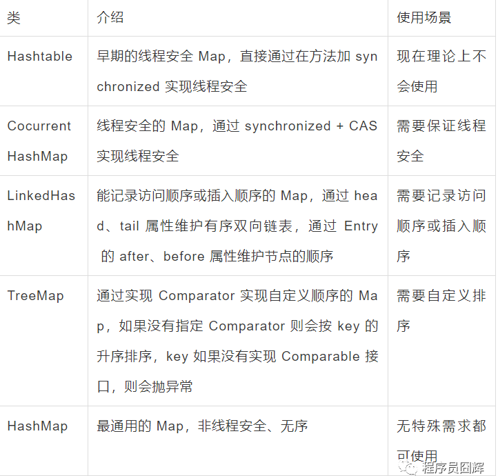 

**相关文章** 

1. [HashMap 这一篇就够了](https://joonwhee.blog.csdn.net/article/details/106324537) 


 